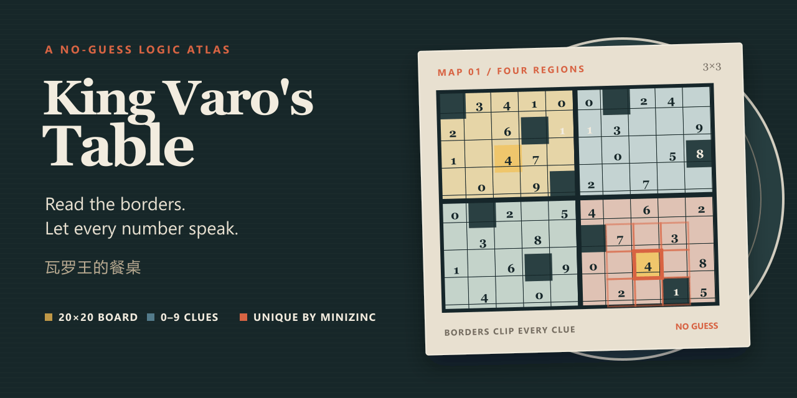

# King Varo's Table

[简体中文](README.zh-CN.md)

A browser-based logic puzzle about restoring the divided map of King Varo's short-lived empire. The included chapter is designed to be solved without guessing.



## Gameplay

Each number counts the bright cells in a centered area of up to 3×3 cells, including the numbered cell itself. Thick country borders clip that area, so cells across a border never count. Mark every cell bright or dark to reconstruct the map.

The current 20×20 chapter contains seven irregular countries. Completing a country advances the royal banquet and reveals a story about its fall; after all seven records are read, a historical epilogue is added to the archive.

## Controls

The interface is currently in Simplified Chinese. Button labels below match the text shown in the game.

| Action | Control |
| --- | --- |
| Mark a cell bright | Left click, or focus the cell and press Enter |
| Mark a cell dark | Right click or Shift+click |
| Return a cell to unknown | Repeat its current bright or dark action |
| Request a necessary step | Select `给我一个必然步骤` |
| Check or clean the board | Select `检查当前推理` or `清除错误答案` |
| Restart or reread stories | Select `重新开局` or the map archive button |

## Features

- Seven connected, irregular countries with region-clipped clues covering 0–9.
- A visible single-clue deduction path, plus MiniZinc verification that each country has no second solution.
- Hints calculated from the player's current board, contradiction reporting, region filtering, and wrong-answer cleanup.
- Banquet milestones, one-time fall records, a chapter epilogue, a rereadable archive, and versioned local saves.
- Public level data contains the map and clues but omits the target solution.

## Development

Requirements:

- Python 3;
- Node.js with npm;
- MiniZinc with the Gecode solver for level generation and the full uniqueness checks.

Run the local prototype:

```powershell
npm start
```

Then open <http://localhost:4173/>.

Run the test suite:

```powershell
npm test
```

Regenerate the committed level:

```powershell
npm run generate
```

Generation overwrites `web/data/demo-level.json` and fails unless MiniZinc proves every country unique.

## Documentation

- [Narrative packaging](docs/design/narrative-packaging.md)
- [Hint-system guardrails](docs/design/hint-system.md)
- [Gameplay lineage research](research/proverbs/gameplay-lineage-2026-08-28.md)
- [Repository layout](docs/development/repository-layout.md)

## Status

Version `0.3.0` is a locally playable prototype with one seven-country chapter. The interface is Simplified Chinese and currently targets desktop pointer input. Enter can mark bright cells, but complete keyboard-only and touch controls are not implemented. There is no hosted public demo.

The 26-test suite passed during this README audit. Finished art, production story content, and a multi-chapter campaign remain to be built.

## License

No open-source license is currently included in this repository. Source availability does not grant permission to reuse, modify, or redistribute the code or game content.
