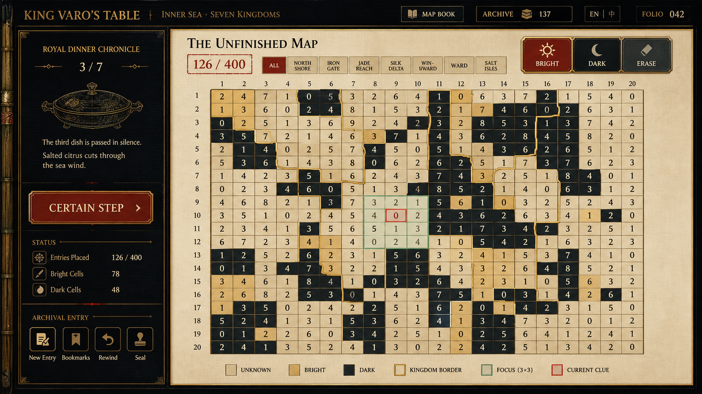
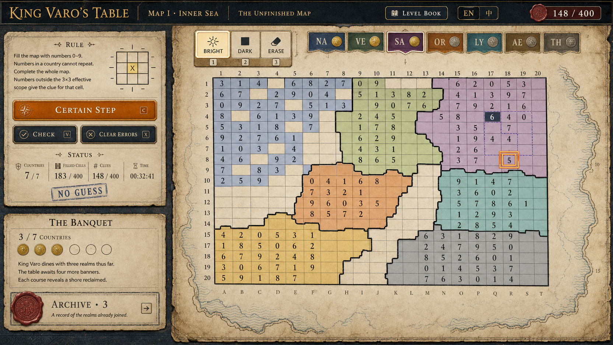
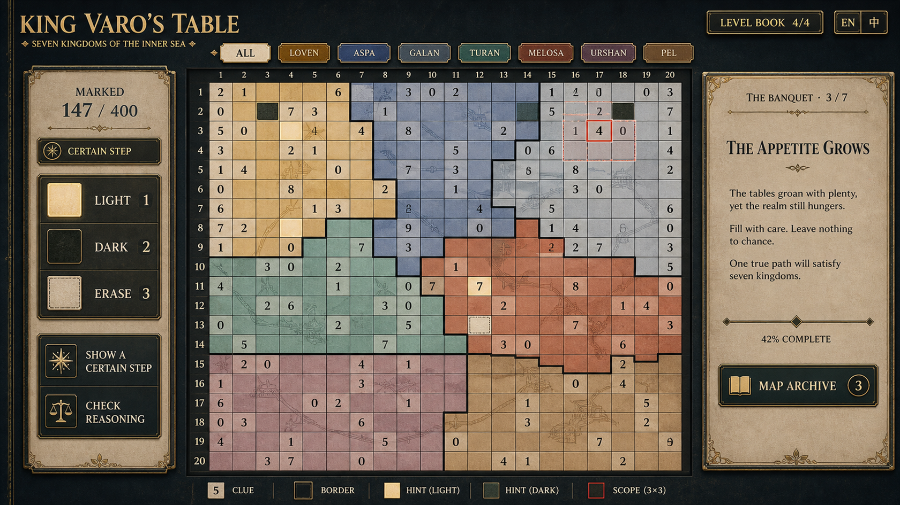
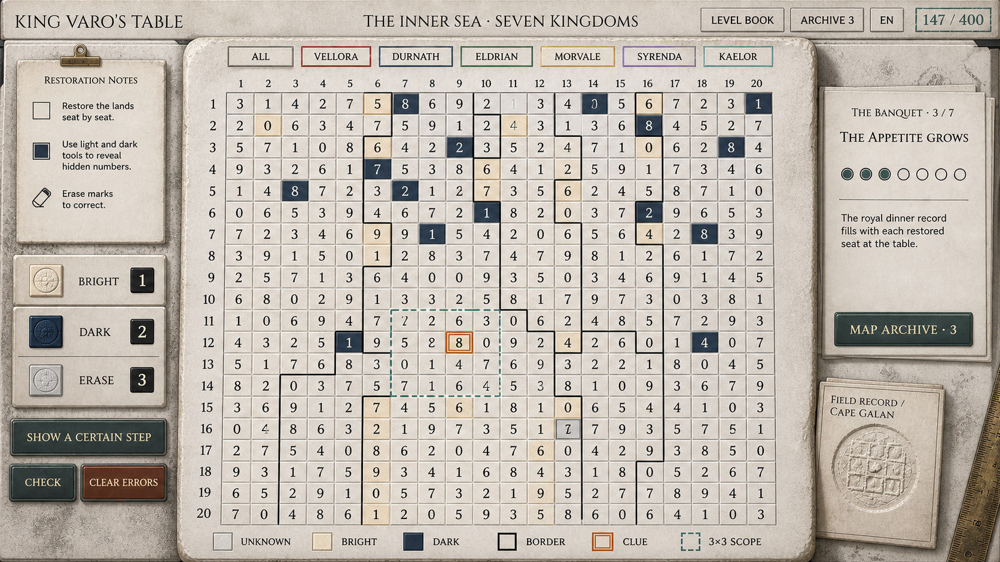
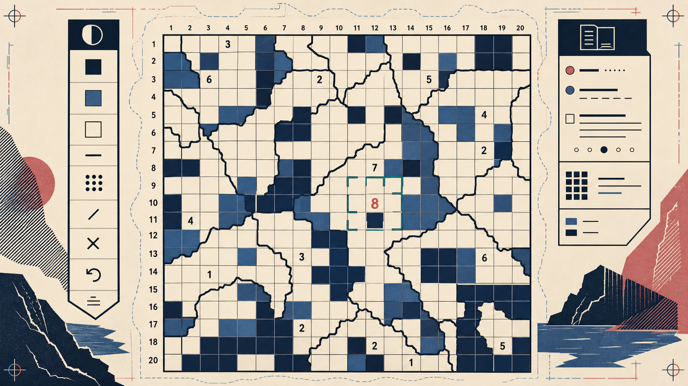

# 《瓦罗王的餐桌》UI 原画探索与验收

日期：2026-08-30  
范围：`内海七国`进行中的桌面端主界面；五张图均为原画方向，不是可直接嵌入游戏的最终界面。

## 已核对的产品约束

《瓦罗王的餐桌》不是一般的数字填格：数字统计的是**同一国家内、以自身为中心、最多 3×3 范围中的亮格数**。因此，粗国界、当前线索与其有效范围本身都是核心玩法信息，不能被历史纹样淹没。

评审时固定保留以下信息层级：

1. 20×20 棋盘、国家边界、数字线索与亮／暗／未知状态；
2. 亮格、暗格、擦除三种落笔工具与当前选择；
3. 地区筛选、提示、检查、清错、进度与键盘快捷键；
4. 晚宴进度、亡国档案与地图册；
5. 材料、纹样和世界观装饰。

## 评分口径

| 方向 | 题材与文化感 30 | 可用性 30 | 玩法准确性 25 | 落地性 15 | 总分 | 验收 |
| --- | ---: | ---: | ---: | ---: | ---: | --- |
| 01 漆器档案／朱砂修复 | 29 | 26 | 22 | 12 | **89** | 有条件通过 |
| 02 航海图册／港口羊皮卷 | 27 | 27 | 17 | 13 | **84** | 修改后通过 |
| 03 晚宴镶嵌／石材地图 | 28 | 25 | 23 | 12 | **88** | 有条件通过 |
| 04 碑刻拓印／田野账册 | 27 | 29 | 23 | 14 | **93** | 布局通过；视觉需迭代 |
| 05 被删王名／第二版地图 | 30 | 28 | 24 | 13 | **95** | 视觉方向通过；功能语义需落地校正 |

## 五套原画

### 01 · 漆器档案／朱砂修复

深墨漆匣、旧金国界、朱砂焦点和玉绿作用范围给出了最鲜明的专属气质；棋盘也保持了良好的可数性。落地时应把左下角的“新条目／书签／回溯／封印”等概念替换回现有的检查、清错、重开与档案功能，减少过多金色描边，并用真实本地化文本替代烘焙文字。

### 02 · 航海图册／港口羊皮卷

这是“修复历史地图”叙事最直观的一稿，棋盘和国界辨识度很高，适合成为关卡册或战役总览的视觉来源。但原画左栏把规则误写为“国家内数字不能重复”，与项目实际逻辑相反；同时“7/7 国家”与“3/7 晚宴进度”含义冲突。修正这两项后再采用，且羊皮纸纹理只应留在棋盘外缘。

### 03 · 晚宴镶嵌／石材地图

石灰岩、玛瑙和克制的油灯光把“餐桌”与“国家地图”合在同一个隐喻中，故事面板也很适合完成国家后的节奏停顿。问题是左右栏偏宽，长时间解题时主棋盘可用面积略吃紧；已完成地区的细线插画必须降低透明度，不能与数字线索争夺注意力。

### 04 · 碑刻拓印／田野账册（推荐的布局骨架，视觉需迭代）

它的中心棋盘、三种工具、行动按钮、地区筛选、晚宴和档案的层级最清楚，因此仍是后续版式基础。后续市场研究显示，其石块、卷轴、尺子、夹子、硬币式工具和堆叠纸张过于接近“博物馆展柜”的泛考古拟物；应保留冷静的灰白／深靛底盘，但把具体语言迭代为“叠印图档／后世修复台”。原画中的虚线作用域视觉上略接近 4×4，正式版必须由代码严格绘制同国的 3×3 覆盖范围；完成国家可再叠加极淡的、仅沿地图边缘出现的局部套印，不能覆盖格内数字。

### 05 · 被删王名／第二版地图（新增的风格化方向）

这张原画把帝国地图理解为一份可以被“再版”的错误出版物：外缘的错版套印、裁切式山水与窄版面标记说明旧的统一叙事正在退后；中心棋盘则像一块干净的印刷版。它是对“叠印图档／后世修复台”的有意识反向尝试——不使用档案桌、石材、卷轴、纹章和仿古道具，而以高对比、平面化的版画／丝网印刷语言建立历史感。

**验收通过项：** `20×20` 棋盘占据绝对面积；粗国界、明暗格和数字可迅速扫读；朱砂当前线索与铜绿角括号范围的职责清楚；印刷错位和山水剪影被限制在格外，未侵入规则面。

**落地前必须修正：** 左侧图标必须配合现有亮格／暗格／擦除的文字、键盘快捷键和 `aria` 标签，不能只凭抽象图标；铜绿角括号必须由程序按“同国且中心 `3×3`”精确裁剪，原画不能作为范围形状依据；行列号只是可选的定位辅助，若不能帮助提示、撤销或无障碍朗读，应移除以降低密度；右侧档案区在正式解题态只能保留紧凑入口，完成国家后才可展开阅读。

## 研究后的落地组合

主线界面仍可用 **04 的布局骨架**，并将其美术语言改为 **“叠印图档／后世修复台”**：平坦、低噪的地图工作面承载棋盘，历史感来自图例、档号、国界覆写、后世校订和完成国家后出现的留存痕迹，而不是常驻古物道具。

同时保留 **05「被删王名／第二版地图」** 作为更强风格化的第二条路线：它用“谁的地名被印上、划掉、再版”的冲突替代“古物修复”的材料感。二者共用同一玩法与信息层级，不应混成一套既有展柜道具、又有强版画装饰的折衷风格。

- 保留 **01** 的朱砂当前线索与玉绿有效范围，作为唯一高饱和交互信号；
- 保留 **02** 的“地图是检索对象”与页边索引，不使用航海装饰或错误规则文案；
- 保留 **03** 的完成后叙事节奏，不让故事正文永久占用棋盘侧栏；
- 保留 **04** 的棋盘优先布局，移除展柜式石／卷轴／尺子拟物。

实现时，所有数字、区域边界、提示范围、键盘焦点和中英文字都应由现有 HTML/CSS/JS 实时渲染；原画只提供色彩、材质、版式和组件意图。窄屏继续沿用当前的粘性工具栏与棋盘内部横向滚动，不把原画中的双侧栏等比例压缩到手机上。完整市场研究与视觉契约见 [UI 参考汇总与审美方向迭代](../../research/ui-references/ui-direction-synthesis-2026-08-29.md) 及 [九款追加参考的第二版地图结论](../../research/ui-references/stylized-counter-edition-synthesis-2026-08-29.md)。

第二轮已进一步锁定“国境严格沿格线、地形图仅作棋盘下层”的硬约束，并新增四张完全不同的地形底图方向；详见 [格线国境＋地形底图第二轮原画与验收](grid-terrain-round-two-2026-08-30.md)。

第三轮新增四张刻意强调“霸业、盛景、征服、帝王”的帝国巅峰方向；完整评分、文件与主界面／章节页取舍见 [霸业／盛景第三轮原画与验收](imperial-splendour-round-three-evaluation-2026-08-30.md)。

随后追加的“王朝末年”探索，将帝国最后征伐与底层衰败放进同一张地图；主界面与章节页的推荐分工见 [残阳王朝：征伐与衰落并存](last-dynasty-duality-2026-08-30.md)。

## 用户选定基准后的再收敛

用户明确选定的三张方案已固定标记为 **S1 暗框晚宴地图**、**S2 平面地图册**、**S3 深靛王室纪年**，并已连同“图中文字并非产品需求”的说明归档在 [用户已选 UI 原画基准](user-selected-references-2026-08-30.md)。其中 S2 所写“同一国家内数字不能重复”与实际玩法不符，不能进入产品规则。

这轮偏好将主方向收敛为：**平滑暖纸工作面＋深墨框架＋大陆地图册式的信息结构**。历史感仅来自虚构地图的版面秩序、档案与叙事节奏，避免让人联想到真实文明、国家或宗教；背景禁止鱼鳞感颗粒、织纹、马赛克、砂砾与强纸纤维纹理。四张据此新绘的原画及逐项可用性验收见 [S1／S2／S3 偏好驱动的四稿](user-preference-four-variants-2026-08-30.md)。推荐采用 **17「晚宴账册」** 的版式骨架，并吸收 **16「大陆名录」** 更克制的顶栏与地形底图处理。

在同一组 S1／S2／S3 基准上，用户又明确要求融合“深墨金框气质、蜡封／徽标印记、细线插画与昼夜图标”。四张融合原画的逐项验收、排名与最终组合建议见 [蜡封／徽标／昼夜插画融合四稿](seal-badge-sunmoon-four-variants-2026-08-30.md)。目前推荐以 **20「封印晚宴图册」** 为主界面底稿，并从 23、22、21 分别吸收少量插画笔触、昼夜图标尺度和筛选徽标节奏。
