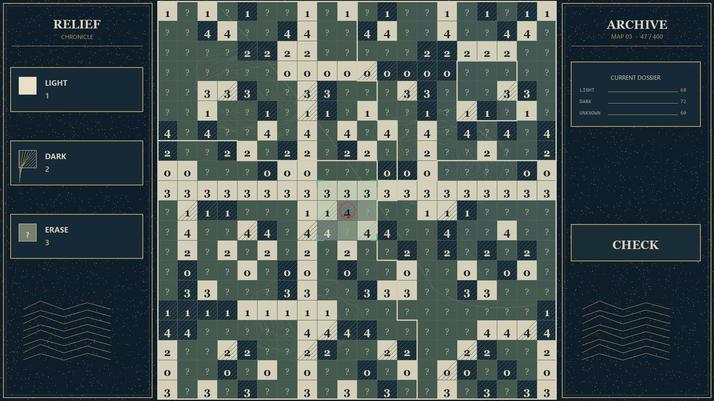
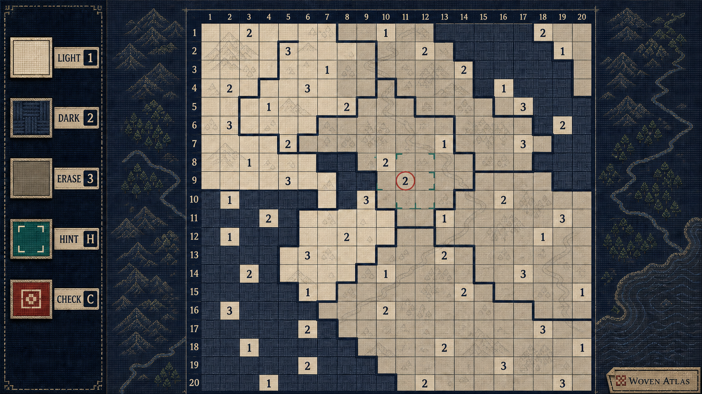
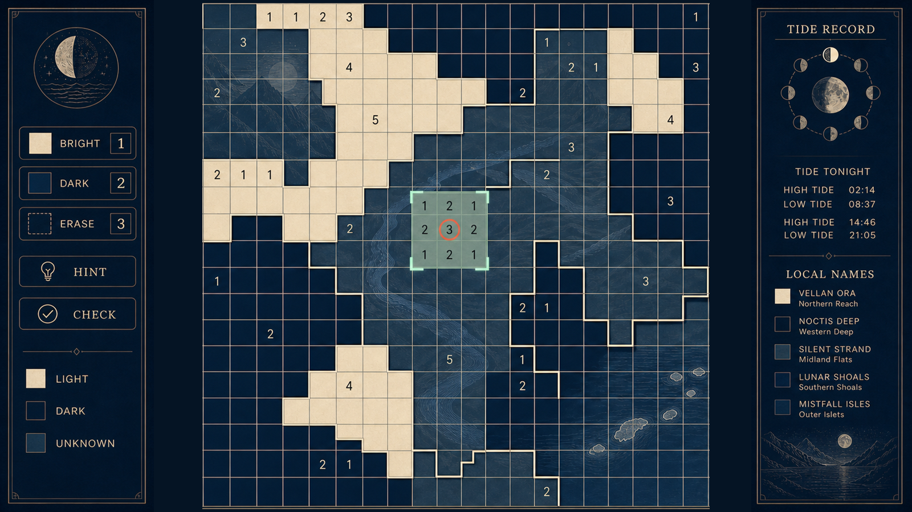
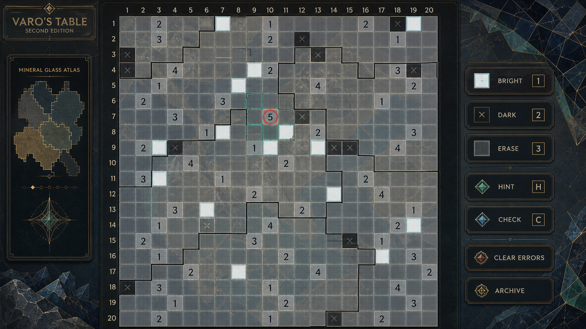

# 格线国境＋地形底图：第二轮 UI 原画探索与验收

日期：2026-08-30  
范围：4 张桌面端主解谜 UI 原画。所有图均为视觉方向，不能直接替换 HTML/CSS/JS。

## 这轮不可谈判的规则

> 国境线只能位于两个相邻格子的公共水平／垂直格线上；绝不斜切、弯切、跨越或终止于格内。

地形图允许位于棋盘下方，使命是让国家被理解为一片大陆上的地理区域；它不表达亮／暗／未知，也不能成为假国境。完整硬性契约见 [棋盘国境线与底图的硬性视觉契约](grid-border-terrain-contract.md)。

现有代码已经按国家归属差异给单元格加 `edge-top/right/bottom/left`，以 3px 边框画出边界；因此原画应服从这套数据驱动结构，而不是要求美术描出一条穿格的地图轮廓。

## 统一验收量表

每项 25 分，总分 100。分数是对**方向**的判断，不是原画作者或生成质量的排名。

| 项目 | 看什么 |
| --- | --- |
| 可用性 | 棋盘是否绝对优先；格态、数字、国境、当前线索、精确同国 `3×3` 范围和工具是否可快速读取。 |
| 风格化 | 是否有鲜明、原创、非主流商业的图像论点；是否避开泛古董、4X、手游和真实文化挪用。 |
| 美观 | 色彩、构图、留白、材质与叙事焦点是否形成一个完整画面。 |
| 主题适配 | 是否服务“后世修复一张短命帝国遗图，地方记忆仍留存”的故事，而非把玩家放上征服者的王座。 |

**硬性门槛：** 任何国境线斜穿或终止于格内，直接判定不可用；任何地形压过数字、格态或边界，也不能作为实装基准。

## 汇总结果

| 排名 | 原画 | 格线国境 | 可用性 | 风格化 | 美观 | 主题适配 | 总分 | 结论 |
| ---: | --- | --- | ---: | ---: | ---: | ---: | ---: | --- |
| 1 | 07 织锦疆域／Woven Atlas | 通过 | 21 | 24 | 23 | 22 | **90** | 推荐为下一阶段的风格主线。 |
| 2 | 08 潮汐夜图／Tidal Nocturne | 通过 | 20 | 23 | 24 | 21 | **88** | 推荐保留为更静谧、地理感最强的备选。 |
| 3 | 09 矿彩玻璃地形图／Mineral Glass Atlas | 通过 | 21 | 22 | 22 | 20 | **85** | 可用，但不作为首选；应去掉商业化边框感。 |
| 4 | 06 地势编年图／Relief Chronicle | 几何通过，边界层级不足 | 15 | 19 | 15 | 17 | **66** | 不建议沿此稿继续；只保留“低对比等高线”原则。 |

## 06 · 地势编年图／Relief Chronicle



**验收。** 格子和可见转折都没有斜穿问题，且 `20×20` 占比足够；但实际阅读中，国境的粗细与格内的问号、斜线填充、等高线相互竞争，国家轮廓没有成为第一层信息。因此它满足几何约束，却未满足“边界是玩法”的功能要求。

**可取：** 石灰／苔绿／夜蓝的地势刻印、让河谷和山脊低对比地透在格下。  
**不可取：** 侧栏星点、重复密集数字、过多格内图案与近似同权重的边线。  
**结论：** 不继续做完整方向；若使用，只提取 10–14% 不透明度的等高线底图。

## 07 · 织锦疆域／Woven Atlas — 推荐



**验收。** 这是四稿中边界读感最稳定的一张：粗深色国境始终贴住格线，棋盘约占画面 56%，工具有文字与键位，朱砂线索和孔雀绿范围一眼可见。织纹把山、林、河、海岸串成一张连续的地理底图，同时没有在格间画出第二套“假国境”。

**为什么它最适合。** “织”是对本作故事极好的原创隐喻：帝国曾试图把七国织成一张统一版图，但每个地区依然保留不同线索与颜色。它有文化历史感，却不借用真实民族纹样；与既有的档案／再版方向也没有重复。

**必须修正后再落地。**

- 将未知格内的山、林、提花纹样再降 15–20% 对比度，并给数字放稳定的纯色或半透明底。
- 深蓝“暗格”的织纹必须与未知格材质明显不同，同时配合图标／描边，避免只以色彩区分。
- 地形只应由 `board::before` 一类的下层连续图绘制；单元格与程序生成的国境需要处于更高的层级。

## 08 · 潮汐夜图／Tidal Nocturne — 地理感最强的备选



**验收。** 海面、月相、河谷和岛链使“内海七国”首次有了连贯的大陆／海域空间感，接近用户要求的史诗地图底图，而不是一张纯抽象棋盘。金色国境严格阶梯化并沿格线走，中心范围示例明确。

**优点。** 构图安静、色彩成熟，地形可以承载“国家版图”而不必把国家涂成旗帜色；它也是四稿里美观分最高的一张。  
**风险。** 格内水纹、月相卡和右侧“潮汐记录”比解谜所需的内容更丰富，容易把主界面推向一张漂亮但常驻叙事过多的地图。实装应将水纹压到 10–14% 对比度，右栏收为紧凑档案入口，完成国家后再展开。

## 09 · 矿彩玻璃地形图／Mineral Glass Atlas



**验收。** 格线边界、当前线索、范围和工具均清晰，底图也没有越级压住规则层。矿彩颜料和雾蓝珐琅让它拥有强烈的静物感。

**问题。** 两侧厚重的面板、切面晶体装饰和金边按钮已经接近主流奇幻策略／收藏手游的语言；棋盘约占 54% 宽度，略低于本轮目标。  
**结论。** 保留“矿物色层作为极弱地形”的想法，但不建议采用该面板语言；若继续，先收窄两侧栏、移除外侧晶体装饰与金属框。

## 结论：选择 07，保留 08

下一阶段应以 **07「织锦疆域」** 作为风格主线：它最有原创性，也最符合用户对强风格化、非主流商业画风的偏好；其地形底图与严格格线边界能同时成立。

**08「潮汐夜图」** 不应和 07 混成折衷稿，而应保留为另一条气质更静谧、海域更明确的备选线。若后续故事重点转到内海、港湾、迁徙与夜航，它会优于 07。

实际实现可沿下面的层级进行：

```text
地形底图（连续、低对比、可跨国）
  ↓
单元格的亮／暗／未知状态
  ↓
普通格线与数据生成的阶梯国境
  ↓
数字、键盘焦点、朱砂当前线索、铜绿精确范围
  ↓
工具与按需打开的国家档案
```

这样既可以获得史诗地图的地域感，又永远不会让一条好看的山脊或海岸线变成错误的游戏规则。

## 出图提示组与保存位置

四稿均由独立子代理使用内置图像生成流程完成，随后由主代理按本文件的统一量表复核。

| 稿件 | 最终提示的核心 | 项目内成品 |
| --- | --- | --- |
| 06 | 暗蓝／苔绿／石灰的手工等高线刻印，地势在格下，阶梯国境与 `20×20` 主盘优先。 | [06-relief-chronicle.png](06-relief-chronicle.png) |
| 07 | 原创提花织锦地形，山林河岸以低对比经纬线相连，深靛／土红／亚麻／孔雀绿。 | [07-woven-atlas.png](07-woven-atlas.png) |
| 08 | 午夜靛蓝的月相、潮汐、河谷与岛链，夜航蚀刻图压在格层之下。 | [08-tidal-nocturne.png](08-tidal-nocturne.png) |
| 09 | 黑曜石、雾蓝珐琅与矿物颜料的抽象大陆地形，严格格线国境与低对比底图。 | [09-mineral-glass-atlas.png](09-mineral-glass-atlas.png) |
