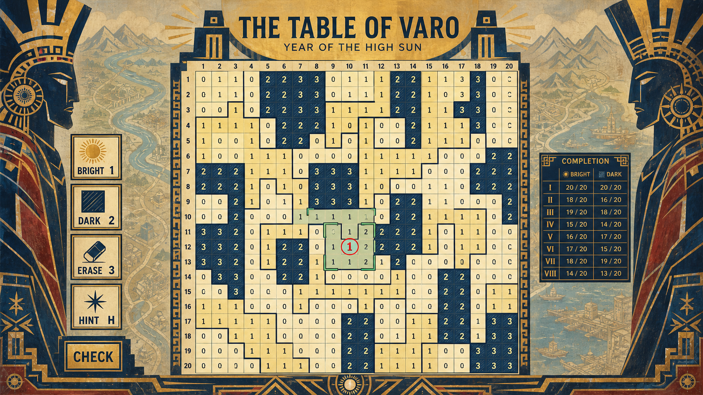
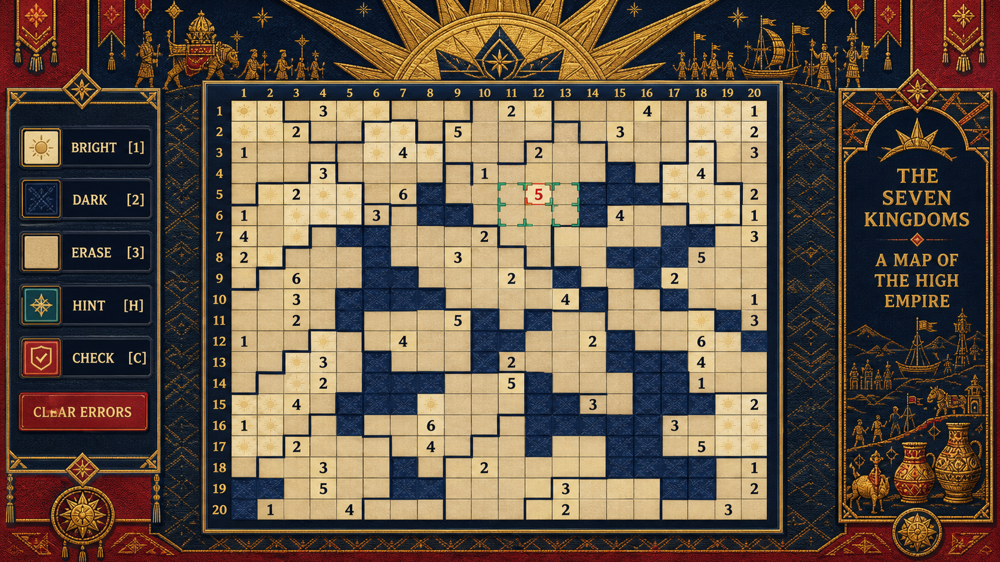
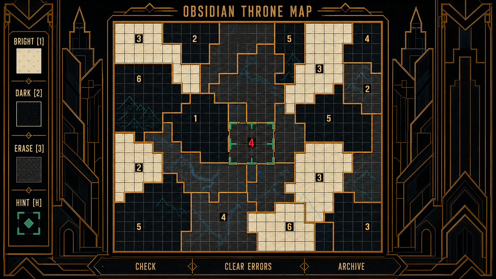
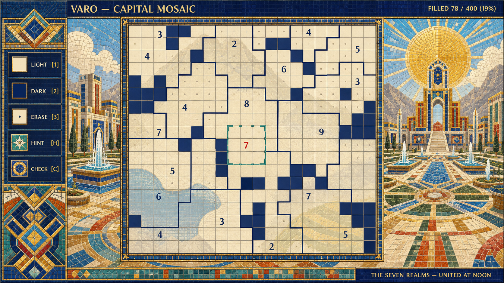

# 霸业／盛景／征服／帝王：第三轮 UI 原画与验收

日期：2026-08-30  
范围：4 张桌面端主解谜 UI 原画。目标是刻意探索瓦罗帝国巅峰时期的视觉自述，而不改变玩法和国境数据规则。

## 先给结论

> **首选：12「黑曜御座军机图」**。它用棋盘本身的秩序、铜金阶梯国境、黑曜建筑和低对比山河来表达帝王霸业，既有压迫性的盛世气魄，又没有退化为 4X 指挥面板。

**13「宝石马赛克圣城图」**是最华美、最适合主菜单／章节开场／完成国家庆典的方向；但两侧圣城景观太强，主解谜页应先压缩它。  
**11「万邦朝贡织幕」**是最具叙事性的选择，适合“帝国如何宣传自己”的章节态；但朝贡元素要按需出现。  
**10「日轮凯旋壁画」**气势正确，却最容易落入“把历史脸谱贴在棋盘两边”，不建议继续作为主线。

## 共同硬约束的复核

四稿均通过几何国境门槛：可见的国家边界都只沿单元格公共水平／垂直边折转，没有一条斜线、弧线或格内终点。地形只作棋盘下层／外缘地理表达；正式实现仍必须由国家归属数据给单元格生成边界，不能描摹图片。

## 评分

每项 25 分。总分是方向的取舍，不是生成作品的排名。

| 排名 | 原画 | 可用性 | 风格化 | 美观 | 主题适配 | 总分 | 判断 |
| ---: | --- | ---: | ---: | ---: | ---: | ---: | --- |
| 1 | 12 黑曜御座军机图 | 23 | 24 | 23 | 25 | **95** | 主解谜页首选。 |
| 2 | 13 宝石马赛克圣城图 | 20 | 24 | 25 | 25 | **94** | 盛景页／菜单首选；主盘须更大。 |
| 3 | 11 万邦朝贡织幕 | 21 | 25 | 23 | 24 | **93** | 最强帝国宣传叙事；外缘需收束。 |
| 4 | 10 日轮凯旋壁画 | 18 | 24 | 22 | 23 | **87** | 只保留日轮与大色块原则。 |

## 10 · 日轮凯旋壁画／Solar Triumph Mural



**优点。** 暖金、朱红、天青和深靛，以及日轮、凯旋门、统治者剪影，第一眼就传递了“帝国刚刚统一山河”的盛世姿态；棋盘、工具、红色线索与铜绿范围仍可读。

**为什么只得 87。** 其真正的大陆地形主要停在棋盘两侧，而非有效地沉在格子下；两张具象侧脸也容易让虚构世界滑向某个现实古文明的拼贴。棋盘的横向占比不足，人物壁画抢走了视线。

**可保留的做法：** 日轮、粗大色块、凯旋拱的抽象几何和“高日之年”的章节语气。  
**必须舍弃的做法：** 具象头盔肖像、常驻完成表、把气势全放在棋盘以外。

## 11 · 万邦朝贡织幕／Tribute Tapestry



**优点。** 这是四稿中“征服之后的富庶与秩序”叙事最明确的一张：日冠、队列、贡器和盛世标题环绕一块被统一的地图。象牙日纹亮格、深蓝交织暗格与空白未知格有形状差异，不只依赖颜色；阶梯国境读感稳定。

**风险。** 队列、动物、船和器物过多时会像民族风情拼贴，也会挤压主盘。现有格下地理表达仍偏弱。  
**正确用法：** 作为“帝国官方版地图”的章节皮肤：地形在下，庆典织幕只沿页首／完成国家的边缘短暂显现，而不是长驻整屏。

## 12 · 黑曜御座军机图／Obsidian Throne Map — 首选



**为什么胜出。** 它最有“帝王”的气质，却没有依赖人物与皇室道具：巨大的黑曜建筑轮廓像御座厅／城门，铜金阶梯国境像被帝国切割、命名和封存的领土；青蓝河网与山脊确实在棋盘格下方，故地图是空间而不是背景贴纸。

**可用性。** 主盘足够大；国境显著大于普通格线；亮格菱纹、暗格斜线、未知格点纹形成冗余状态语义；朱砂当前数字和铜绿范围很难被误读。它满足“盛世宏大”与“无猜逻辑”必须同时成立的条件。

**落地修正。** 去掉底部金属长按钮的立体质感，改为扁平文字操作带；青蓝地形限制在低对比；完成国家后才让城门／御座出现一段更亮的凯旋动效。这样避免滑入黑金商业策略 UI。

## 13 · 宝石马赛克圣城图／Jeweled Capital Mosaic



**优点。** 它是本轮最漂亮的“盛景”：日轮、圣城、喷泉、广场、群山和水道让帝国首都像统合七国财富的正午舞台。地图底层的山地、水网和几何田野也有史诗地理感，且国境严格贴格线。

**风险。** 两侧首都景观很壮丽，但主盘横向占比约 51%，低于本轮 55% 目标；它较适合一个“帝国完成版图”的开场或完成页面，而非长时间推理。还应将其抽象为虚构马赛克语言，避免过度接近任何真实宗教／王朝建筑。

**正确用法。** 主盘中只保留轻淡马赛克地形、蓝金边界与一条日光章；将大日轮、皇座、喷泉和广场移到开场／章节卡／国家完成叙事页。

## 最终设计判断

不要把四稿折成一张“有壁画人物、有朝贡器、有黑金城门、又有满屏圣城”的总和——那会让霸业变成装饰噪声。

若做**主解谜界面**，选择 **12 的黑曜建筑秩序**：

```text
低对比地形（山脊、河网、旧路）
  ↓
亮／暗／未知格态
  ↓
细格线 + 数据生成的铜金阶梯国境
  ↓
数字、朱砂当前线索、严格同国 3×3 铜绿范围
  ↓
克制工具带与按需档案
```

若做**章节开场、帝王盛景或完成国家的短暂高潮**，选择 **13 的宝石马赛克圣城**。这样既让用户得到“霸业、盛景、征服、帝王”的视觉高峰，也不让帝国的舞台吞没真正需要被解开的地图。

## 出图提示与文件

四稿均由独立子代理使用内置图像生成流程完成，后由主代理统一复核：

| 稿件 | 出图核心 | 保存文件 |
| --- | --- | --- |
| 10 | 暖金朱红的日轮凯旋壁画，帝王剪影与大陆山河环绕严格格线棋盘。 | [10-solar-triumph-mural.webp](10-solar-triumph-mural.webp) |
| 11 | 深蓝绯红鎏金的朝贡织幕，帝国如何炫示丰饶与统一版图。 | [11-tribute-tapestry.webp](11-tribute-tapestry.webp) |
| 12 | 黑曜建筑、铜金秩序和青蓝底图的御座军机地图。 | [12-obsidian-throne-map.webp](12-obsidian-throne-map.webp) |
| 13 | 宝石马赛克、白昼圣城、日轮广场与低对比大陆地势。 | [13-jeweled-capital-mosaic.webp](13-jeweled-capital-mosaic.webp) |
