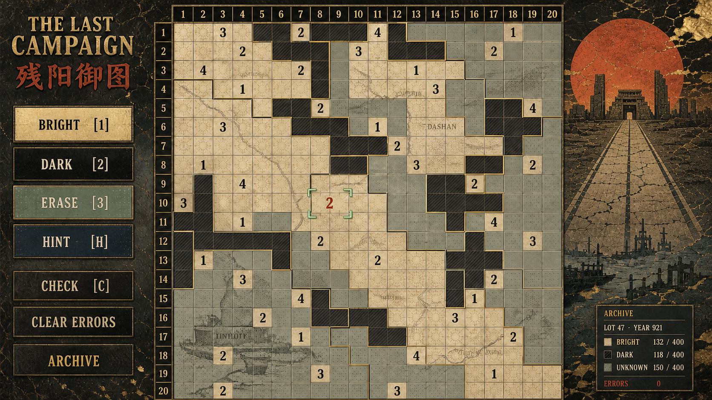
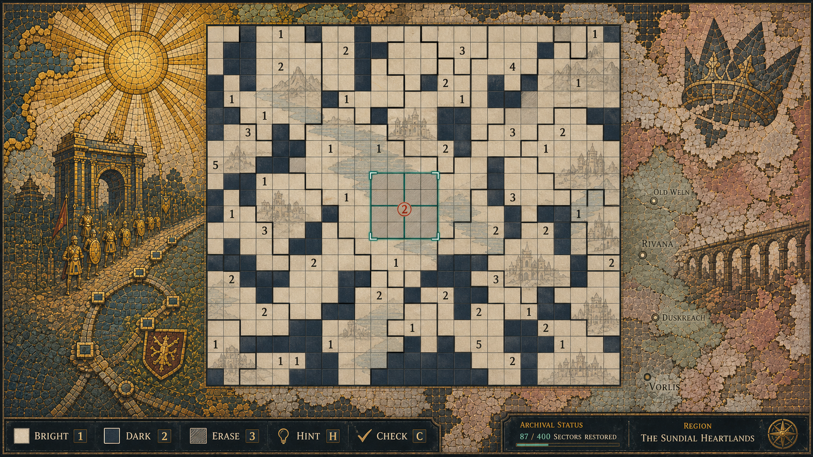

# 残阳王朝：征伐与衰落并存的 UI 方向

日期：2026-08-30  
基于用户补充：**“增加一点王朝末年的感觉：一面是征伐，一面是衰落。”**

## 新的视觉判断

正确做法不是把 UI 粗暴切成“左边黄金凯旋、右边灰色废墟”两半，而是让玩家看见：

> 帝国的最后一场征伐仍在官方地图上被宣布为凯旋；但它所经过的河道、港口、道路和旧城，已经从版图底下开始失去颜色和秩序。

因此，这轮推荐的主方向是 **14「残阳御图／The Last Campaign」**：征伐与衰败是同一张地图上连续发生的两层，不是两个彼此无关的舞台布景。

## 视觉分层：不要让末日感破坏规则

```text
帝国官方层：日轮、军道、凯旋门、褪金版式（页首／页边）
  ↓
地方地形层：干涸河床、废港、沉寂旧路、失修水道（棋盘之下，低对比）
  ↓
亮／暗／未知格态
  ↓
细格线与数据生成的阶梯国境
  ↓
数字、朱砂当前线索、严格同国 3×3 铜绿范围
  ↓
完成后才浮现的地方旧名／档案证词
```

裂纹、剥落、错版金箔只能在**页面外缘或低对比地形层**中出现；它们绝不可以穿过单元格成为另一条假国境，或遮蔽数字。

## 两张原画的独立验收

| 稿件 | 格线国境 | 可用性 | 风格化 | 美观 | 征伐／衰落主题 | 总分 | 最佳用途 |
| --- | --- | ---: | ---: | ---: | ---: | ---: | --- |
| 14 残阳御图／The Last Campaign | 通过 | 22 | 24 | 23 | 25 | **94** | 主解谜页首选。 |
| 15 裂冠王朝图／Fractured Dynasty Atlas | 通过 | 20 | 25 | 25 | 25 | **95** | 章节开场、帝王盛景／败相的叙事高潮。 |

15 的画面总分更高，是因为它作为一幅单独的画极其强烈；但主解谜页首选 14，因为它把对比放进连续地图，不会让两侧景观吞掉棋盘。

## 14 · 残阳御图／The Last Campaign — 主解谜页首选



**征伐。** 残阳、军旗、笔直军道与角式城门仍然发布“最后凯旋”的帝国官方叙述。  
**衰落。** 干涸河床、港口残影、褪金和失修道路从地形层显出；它们不是血腥败相，而是基础设施与地方秩序在帝国地图内部慢慢沉没。  
**可用性。** `20×20` 主盘及标尺约占画面 56%；阶梯国境、数字、三种格态、当前朱砂线索和铜绿范围都可以先读到。

**需要修正：** 左下旧港残影仍略密，正式实现应再降 15–20% 对比度；所有烘焙地名、统计文字和范围框必须替换成程序／本地化内容。

## 15 · 裂冠王朝图／Fractured Dynasty Atlas — 章节盛景首选



**征伐。** 左侧金日、凯旋拱、队列与被纳入皇权的道路展示帝国最自信的版本。  
**衰落。** 右侧断冠、剥落马赛克、失修高架渠、雾中旧城和重新出现的地方地名提醒玩家：统一叙事正在失去边缘。

它实现了“一面征伐、一面衰落”的直觉，但两端对照偏明显。正式游戏中建议把这张作为章节开场／完成一国的档案卡；主棋盘则采用其**由金到褪粉、由完整到错位**的渐变原则，而不是完整照搬左右分屏。

## 最终建议：以 12 为骨架、以 14 为叙事气候

上一轮的 **12「黑曜御座军机图」**仍是最清晰的帝王霸业布局骨架；本轮的 **14「残阳御图」**提供它缺少的王朝末年气候。

下一次细化可采用这一条非常克制的组合：

- 主盘、铜金阶梯国境、建筑秩序：取自 12；
- 低对比河网、旧路、废港和褪金地形：取自 14；
- 国家完成时短暂露出的断冠／旧名／地方证词：取自 15；
- 不保留任何具象脸谱、真实文化暗示、资源条、兵种或常驻凯旋景观。

这样既能让帝国“看起来仍然强大”，又能让玩家在每一格地图底下感到它正在失去对土地的解释权。

## 出图提示与文件

两稿均由独立子代理使用内置图像生成流程完成并保存到项目：

- [14-last-campaign.webp](14-last-campaign.webp)：残阳金、朱砂、煤黑、病态青绿的最后凯旋；地形底下有干河、废港、旧路与褪金。
- [15-fractured-dynasty-atlas.webp](15-fractured-dynasty-atlas.webp)：同一马赛克地图从金日凯旋、行军与凯旋拱，连续褪变为断冠、雾城与失修水道。
