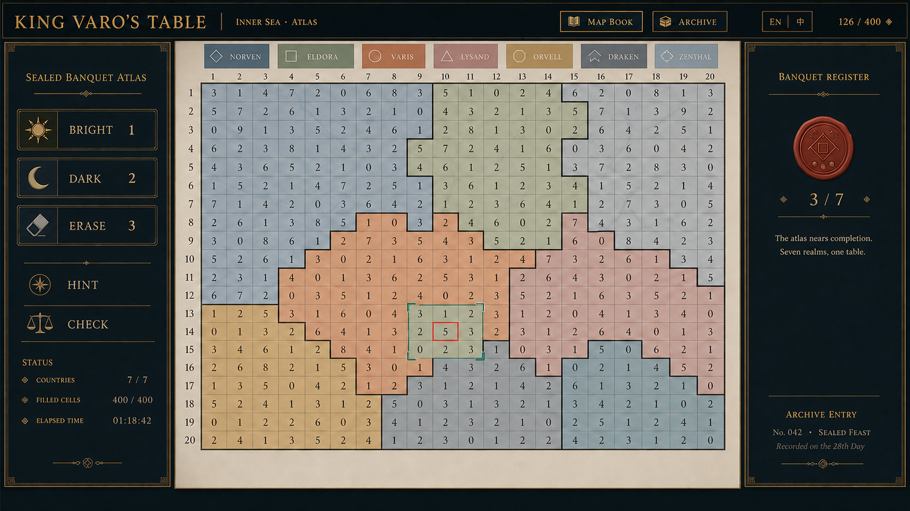
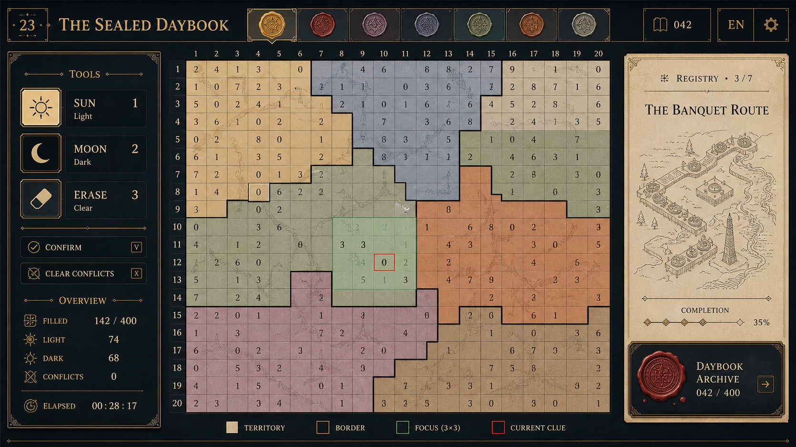
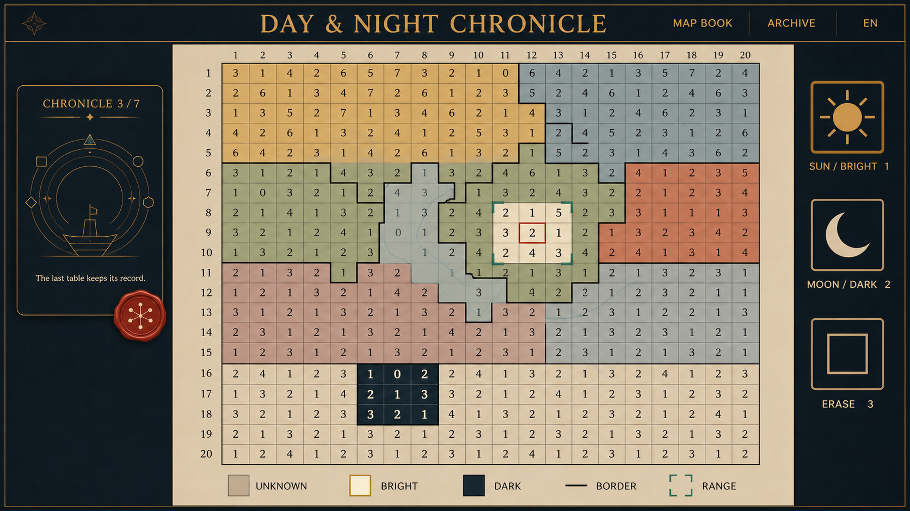
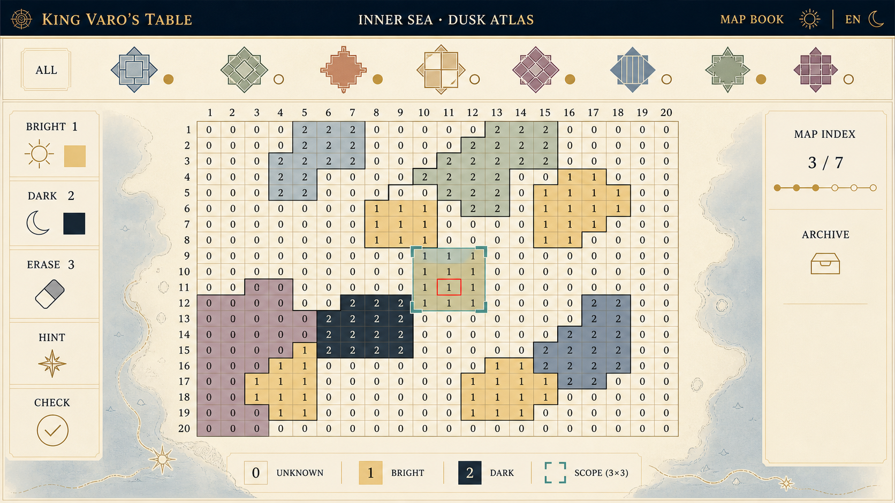

# 蜡封、徽标、昼夜插画融合四稿

日期：2026-08-30  
目标：把用户明确喜爱的三项语言收敛为同一套可落地的主界面，而不是拼贴三种仿古道具。

## 输入偏好（仅作视觉参考）

- **S1／图 1：** 深墨框架、旧金细线、暖色主盘、庄重而克制的三栏节奏；
- **S2／图 2：** 蜡封、筛选徽标、进度标记作为“地图册的索引系统”；
- **S3／图 3：** 平面细线插画，以及能一眼区分亮格／暗格的太阳与月亮工具图标。

参考图中的标题、国家名、数值和规则文案均**不是**项目需求。尤其 S2 的“同一国家内数字不能重复”与项目玩法不符，不能采用。

## 共同验收线

1. 20×20 主棋盘优先；国家边界只走相邻格子的水平／垂直公共边，绝不切穿格内。
2. 朱砂当前线索必须落在铜绿、同国裁剪的 3×3 有效范围中。
3. 太阳＝亮格、月亮＝暗格、橡皮＝擦除；不能只依赖颜色区分。
4. 所有徽标、蜡封与插画均为虚构抽象资产；不指向现实文明、国家、宗教、纹章或军事符号。
5. 全屏为平滑哑光面：禁止鱼鳞、点阵、纸浆颗粒、砂砾、织纹、马赛克、裂纹和做旧噪点。历史感只来自信息结构、印章状态和插画笔触。

## 四稿与验收

| 排名 | 原画 | 可用性 30 | 三项融合 30 | 美观 25 | 题材适配 15 | 总分 | 结论 |
| --- | --- | ---: | ---: | ---: | ---: | ---: | --- |
| 1 | [20 · 封印晚宴图册](20-sealed-banquet-atlas.webp) | 29 | 30 | 23 | 15 | **97** | 推荐为主方向 |
| 2 | [23 · 封印日记册](23-sealed-daybook.webp) | 28 | 28 | 24 | 14 | **94** | 作为局部增强来源 |
| 3 | [22 · 昼夜编年](22-sun-moon-chronicle.webp) | 26 | 25 | 23 | 15 | **89** | 昼夜工具的备选构图 |
| 4 | [21 · 暮色徽标地图册](21-badge-atlas-at-dusk.webp) | 24 | 23 | 20 | 14 | **81** | 留作筛选／索引参考 |

### 20 · 封印晚宴图册（推荐）



这是目前最完整的融合：S1 的深墨金线框架与温暖主盘、S2 的顶部抽象地域标记和右侧单枚进度蜡封、S3 的太阳／月亮／橡皮工具语言都各司其职。棋盘足够大，蜡封只承担档案进度，不会抢走数字与国界的注意力。

**落地建议：** 以此稿作主界面骨架；顶部虚构地区名改为真实关卡／国家数据与本地化文本。将右栏故事在解题态压缩成一张可展开卡，避免它永久占据阅读空间。为补足 S3 的插画感，可在右栏卡片中加入一张“抽象宴席路线／虚构海岸索引”的细线图，不使用建筑、人物、船只、王冠或写实地标。

### 23 · 封印日记册



顶部一列蜡封式地区标记和右侧细线插画最有记忆点，太阳、月亮、橡皮的文字和形态区分也非常清楚。其国境、范围和当前线索均通过几何验收。

**不直接作为主版的原因：** 右侧插画里的建筑／塔状物容易把“虚构大陆”推向具体欧洲历史地点的联想，和用户的避让要求只差一线；图章数量也略多。保留它的平面细线笔触与少量印记，但把插画内容改成抽象的地形校订线、路线、菜肴摆位图或纯几何索引。

### 22 · 昼夜编年



太阳与新月的尺寸、轮廓和对比度最好，用户所喜欢的“昼夜工具”在这一稿中最先被读到。左侧的细线圆环插画和局部蜡封则给它清晰的章节感；主盘仍是第一视线。

**需要收束：** 右侧工具卡过大，顶部也缺少 S2 那种连续的徽标／印章索引。更适合把它的昼夜图标比例、暗色卡片和侧栏信息节奏移植到 20，而不是单独作为最终版。

### 21 · 暮色徽标地图册



这张对“徽标即筛选器”诠释最直接：顶部是一套抽象、无现实归属的地区印记，页边的极淡海岸插画也保持了平面感。所有边界仍由格线构成。

**不作为主方向的原因：** 它太接近干净的功能样机，深墨金框的庄重气质、蜡封的情绪价值和 S3 的插画笔触都偏弱；棋盘中的状态示意也过于规则，缺少解题中的真实层次。它适合为最终版提供“筛选条和徽标节奏”，不适合负责整套美术。

## 收敛后的正式方向

建议把最终方向命名为 **“封印地图册／Sealed Atlas”**：

```text
深墨金线顶栏：作品 · 地图册 · 档案 · 关卡进度
暖纸工作面：抽象徽标筛选条（每个仅一个小印记）
左栏：太阳亮格 · 月亮暗格 · 橡皮 · 提示 · 检查
中央：最大 20×20 格线地图；低饱和国家洗色；格线阶梯国境
右栏：一个红蜡封进度与可展开的虚构地图／晚宴细线插画卡
底栏：亮／暗／未知／国境／范围／当前线索图例
```

对应关系应固定为：**20 的布局与氛围 + 23 的少量蜡封和细线插画笔触 + 22 的太阳／月亮图标尺度 + 21 的筛选徽标节奏**。这样“印记”服务状态，“插画”服务叙事，“暗框”服务聚焦，棋盘始终服务玩法。

## 生成记录

四张均以内置图像生成流程制作并保存至本目录；提示词共同要求平滑无颗粒表面、虚构非现实文化资产、20×20 棋盘、格线国境、精确同国 3×3 范围和可辨识昼夜工具。它们是视觉原画，不是直接可用的产品界面；最终文字、状态、范围和国界仍必须由现有前端数据实时渲染。
