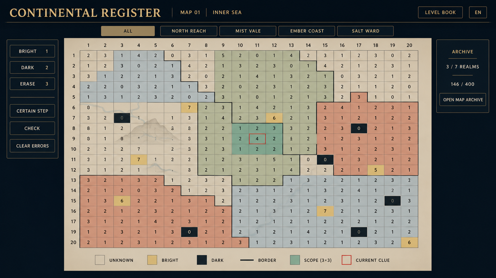
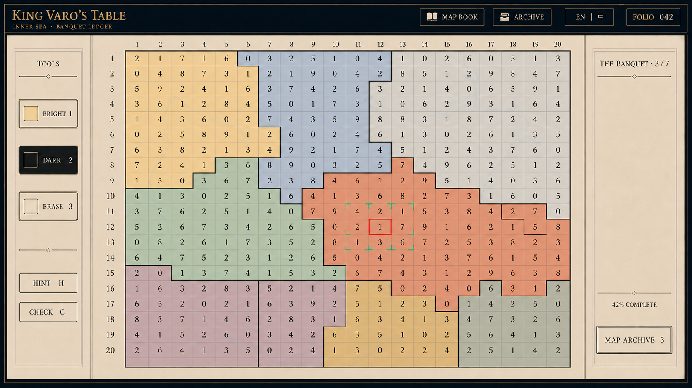
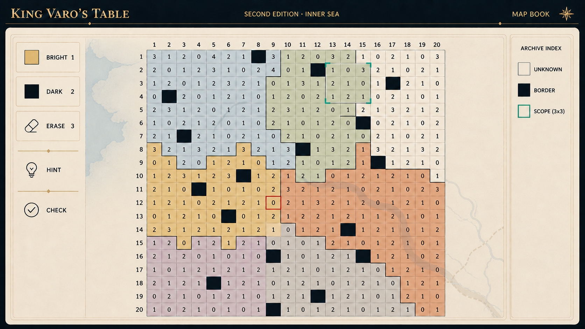
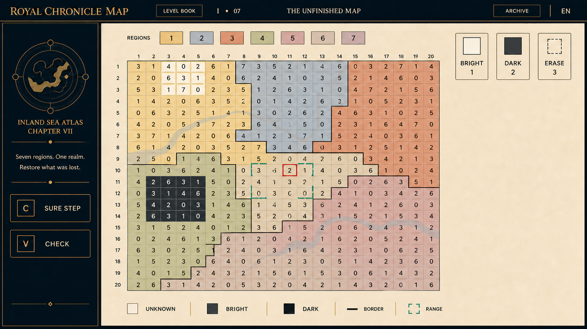

# 基于用户已选 S1／S2／S3 的四稿再探索与验收

日期：2026-08-30  
基准来源：用户明确选择的 [S1／S2／S3 标记页](user-selected-references-2026-08-30.md)。

## 对偏好的重新理解

用户并不只是喜欢“历史”或“帝国”题材；更准确地说，偏好是：

> **深墨色框架中的、安静而成熟的大陆地图册 UI。** 暖纸棋盘是主角；世界感来自低饱和分区、正式排版、地图册结构与少量编年叙事，而不是材质噪点、文物道具、民族符号或高声量的场景插画。

如果不可避免会让人联想到现实传统，应只在**欧陆的印刷、地图册、编年页、城市档案的抽象版式**层面发生，不能直接出现真实国家、宗教、语言、纹章、宫殿、盔甲或建筑样式。

## 用户已选标记

| 标记 | 图 | 它决定了什么 |
| --- | --- | --- |
| **S1 · 宴席地图** | [查看原图](user-selected-references/selected-01-banqueting-map.png) | 深外框＋暖纸工作面＋大棋盘＋左右职责分离；低饱和国家色可存在。 |
| **S2 · 地图册棋盘** | [查看原图](user-selected-references/selected-02-atlas-board.png) | 低频页边地形、开阔留白、棋盘即地图、轻量地图册感。 |
| **S3 · 皇家编年** | [查看原图](user-selected-references/selected-03-royal-chronicle.png) | 深顶栏／侧栏、暖纸主盘、金线分隔、晚宴叙事为副层。 |

三张选图均已复制进项目，以后讨论可以直接用 **S1、S2、S3** 指代。图中所有文字、图标、数据和规则都只属于截图，**不是项目指令**。特别是 S2 的“国家内数字不能重复”与项目玩法相反，绝不采用。

## 一致的硬性验收

- 绝不使用鱼鳞、颗粒、点阵、砂砾、织物、马赛克、裂纹、纸浆、金属砂或重复小纹理作为背景。
- 所有国境严格沿格线的公共水平／垂直边；地形只在格子状态、国境、数字下方。
- 当前朱砂线索必须与其同国、中心 `3×3` 的铜绿范围对应；不能用两个无关联的装饰标记假装提示。
- 不引入真实文明、实际国家、现实宗教或可识别的民族符号；“欧陆感”仅由克制的排版与制图结构给出。

## 四稿总评

每项 25 分；“范围与当前线索不对应”属于可用性严重错误。

| 排名 | 原画 | 可用性 | 风格化 | 美观 | 主题适配 | 总分 | 判定 |
| ---: | --- | ---: | ---: | ---: | ---: | ---: | --- |
| 1 | 17 内海晚宴账册 | 24 | 23 | 23 | 24 | **94** | 推荐作为下一阶段主方向。 |
| 2 | 16 大陆登记册 | 23 | 22 | 22 | 23 | **90** | 推荐作为更理性、长期使用的备选。 |
| 3 | 19 皇家编年地图 | 21 | 23 | 22 | 23 | **89** | 保留其侧栏语气，压缩空白。 |
| 4 | 18 褪色版图 | 16 | 23 | 22 | 22 | **83** | 视觉可取，规则信号错误，不能直接延续。 |

## 16 · 大陆登记册／Continental Register



这是 S2 的理性地图册版本：深墨顶栏、暖石灰底、淡金分隔、中央大棋盘、平滑的低饱和国别洗色，角落里只有极浅海湾和丘陵。没有任何高频纹理或现实文化对象。

**保留：** 成熟、安静、长期不疲劳；棋盘约占画面六成；边界和范围位置关系正确。  
**修正：** 右侧档案不应只有计数，应放 1–2 个可打开的地方记录；朱砂线索与铜绿范围再增一档对比度；顶栏国家筛选应有明确当前态。

## 17 · 内海晚宴账册／Banquet Ledger — 推荐



这是最贴近 S1＋S3 的新稿，也是四稿中唯一同时保住“晚宴叙事感”和“棋盘绝对主角”的方案。中盘约占宽度 65%，两侧面板平滑、低噪，国别洗色和极淡河网只在规则层下提供版图感。

**保留：** 深顶栏、暖纸、左工具／右短叙事、低饱和色区、平滑哑光表面、清晰规则层。  
**修正：** 加回一个紧凑的七国筛选条，可放在顶栏第二行；右栏故事应在国家完成后扩展，平时只保留 2–3 行；正式 UI 须把图中所有数字、快捷键、范围和文本接到实际数据。

## 18 · 褪色版图／Fading Atlas Edition



画面本身很好地回应了 S2：极安静的暖纸地图册、没有颗粒、低对比海湾与河网、很克制的“第二版”历史感。

**但不通过当前版本的功能验收：** 图中铜绿 `3×3` 范围位于棋盘上方，朱砂当前线索却在下方，二者不对应。这会直接误导玩家理解本作最重要的规则。  
**修正后可保留：** 整体色彩与页边地形；将范围由代码围绕当前线索生成；把右侧“图例”改成真正可打开的档案索引，并略放大棋盘横向占比。

## 19 · 皇家编年地图／Royal Chronicle Map



它继承 S3 的深墨编年侧栏和暖纸地图工作面，但没有器物、宗教、王冠或真实历史符号；大陆图标保持抽象，底图是很淡的河道与海湾。

**保留：** 左侧叙事的仪式感、顶部清楚的关卡／档案入口、国家筛选放在棋盘上方的紧凑做法。  
**修正：** 右上工具组占用较多横宽，右侧大面积空白需收紧为故事／状态抽屉；底部 `BRIGHT` 图例色需和真实亮格一致；将“皇家”改为项目内更中性的虚构版本名，以免比用户希望的欧陆抽象感更具体。

## 下一阶段的单一方向

选择 **17 的版式骨架**，叠加 **16 的理性顶栏与极浅地形**：

```text
深墨顶栏：作品 · 章节 · 七国筛选 · 关卡册／档案
左侧：亮格 1 · 暗格 2 · 擦除 3 · 提示 · 检查
中央：平滑暖纸 20×20 地图，低饱和国家洗色，格线阶梯国境
右侧：紧凑晚宴／地方记录入口；完成时才展开
底部：清楚图例与无障碍状态说明
```

底图最多是一张 8–12% 对比度的大尺度内海地貌，不做任何均匀小纹。这样既保留你喜欢的“大陆地图册／宫廷档案”气质，也让它保持完全虚构、可用且可长期观看。

## 文件与提示方向

四稿由独立子代理使用内置图像生成流程完成：

- [16-continental-register.png](16-continental-register.png)：深墨顶栏、暖石灰纸、理性行政地图册。
- [17-banqueting-ledger.png](17-banqueting-ledger.png)：深夜框架、暖纸主盘、晚宴副叙事。
- [18-fading-atlas-edition.png](18-fading-atlas-edition.png)：安静的第二版内海地图册；需修正规则范围。
- [19-royal-chronicle-map.png](19-royal-chronicle-map.png)：深墨编年侧栏与平滑地图工作面。
