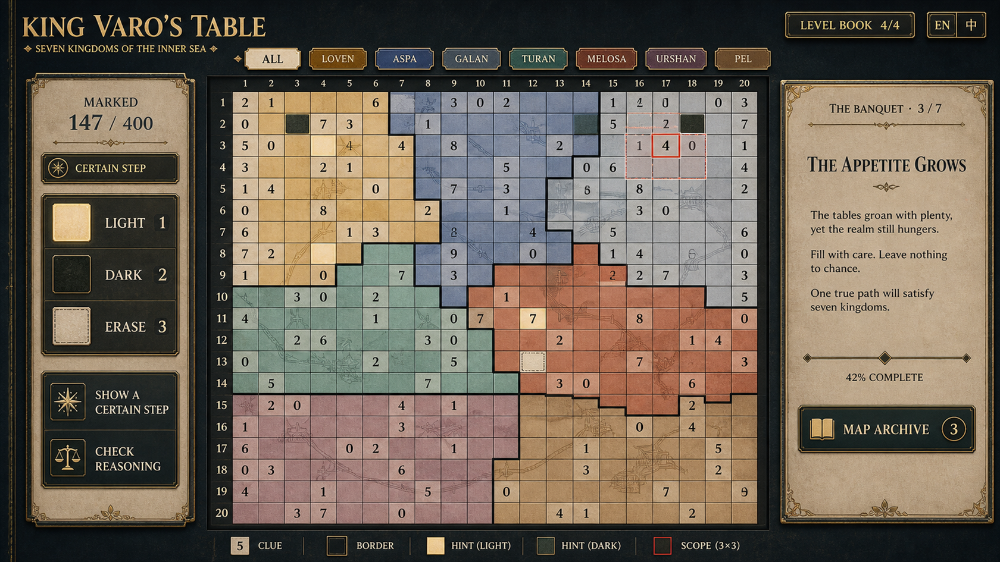
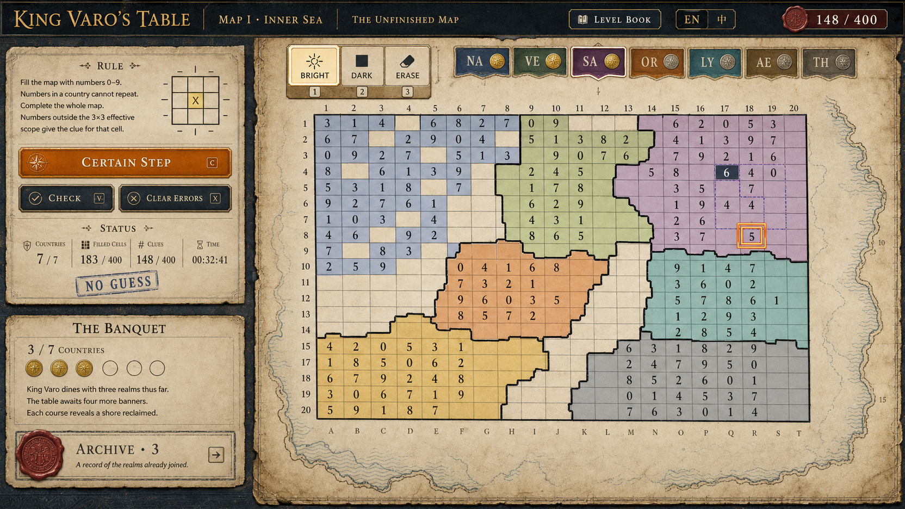
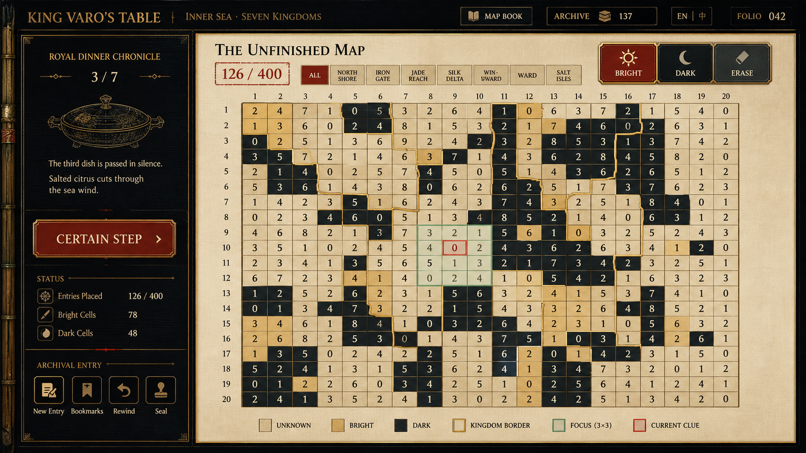

# 用户已选 UI 原画基准（2026-08-30）

这三张截图由用户明确选出，用作**后续原画讨论与出图的审美基准**。它们不是项目功能规格，也不应把图中的虚构文案、错误规则或未实现功能带入产品。

| 标记 | 用户选择 | 本轮可继承的东西 | 明确不继承的东西 |
| --- | --- | --- | --- |
| **S1** |  | 深色外框＋暖纸主盘；顶部国家筛选；中心棋盘；左操作、右叙事的稳定三段层级；低饱和国别色。 | 格内过细的装饰插画、任何烘焙的进度／规则文字。 |
| **S2** |  | 欧陆印刷品式的留白、页边地图线、一个大而干净的棋盘、轻薄国别色和档案入口。 | “Numbers in a country cannot repeat”是错误规则；卷轴、火漆、过度做旧、真实地理联想。 |
| **S3** |  | 深色顶栏、暖纸工作面、简练的金色分隔线、清晰工具区、晚宴叙事作为副层。 | 锅具、真实文化联想、额外“新条目／书签／回溯／封印”等未经确认功能。 |

## 已确认的审美偏好

1. **优先是“欧陆式史诗地图／宫廷档案”的版式感，不是现实欧陆文化复制。** 借的是黑墨顶栏、暖纸页、正式排版、细金线、地图册与宫廷编年的阅读气质；不借真实国家、王朝、宗教、纹章、城市、服饰、语言或建筑。
2. **背景必须安静。** 禁止鱼鳞般的重复颗粒、点阵、织纹、马赛克小块、裂纹噪点、满屏纸浆颗粒、金属砂感和高频装饰。允许极低对比的大面积纸色／墨色轻微变化，但在正常阅读距离不应被辨认为纹理。
3. **结构要像成熟游戏 UI。** 顶栏承担世界／关卡／语言；中央 `20×20` 棋盘承担绝对主任务；左侧是工具与检查；右侧仅保留紧凑进度或按需故事入口。
4. **历史与帝国感来自信息结构。** 国别筛选、编年、地图册、晚宴进程、帝国与地方记录的冲突，优先于王冠、神庙、旗帜、兵种或真实古物。
5. **格线规则高于原画。** 所有国境只能沿单元格公共水平／垂直边折转；地形仅是棋盘下方、低对比的版图底层；数字、状态、国境、朱砂当前线索和铜绿有效范围必须先被读到。

## 新一轮四稿的统一约束

- 美术语言：原创、克制、略偏欧陆印刷／地图册，但没有可辨认的真实文明引用。
- 色盘：深墨蓝黑、暖石灰纸、褪金、低饱和雾蓝／苔绿／黏土红；国家色不得代替玩法状态色。
- 材质：平滑、哑光、低频；没有鱼鳞、织物、像素马赛克、斑点、鳞片或砂砾纹理。
- 叙事：可保留“帝国盛景与末年失色”的张力，但不画具象帝王、宗教、真实国旗或胜利宣传画。
- 文案：原画尽量使用短、真实、可本地化的占位标签；禁止伪文字。实际规则仍是“数字统计本国、以自身为中心、最多 `3×3` 内的亮格”。
